# Applications Integration with Power Apps and Power Automate — Learner Guide

**WSQ Course Code:** TGS-2022015539  |  **Conducted by:** Tertiary Infotech Academy Pte Ltd (UEN 201200696W)  |  **Version v8.0 · 4 September 2026**

## Contents

- [Introduction](#introduction)
- [Course Learning Outcomes](#course-learning-outcomes)
- [Skills Framework Mapping](#skills-framework-mapping)
- [Before You Start — Environment Setup](#before-you-start--environment-setup)
- [Topic 01 — Opportunities for Using Power Platform Apps](#topic-01--opportunities-for-using-power-platform-apps)
  - [Lab 1 — Integration Opportunity Scan](#lab-1--integration-opportunity-scan)
  - [Lab 2 — Feasibility Scan and Middleware Selection](#lab-2--feasibility-scan-and-middleware-selection)
- [Topic 02 — Power Automate](#topic-02--power-automate)
  - [Lab 3 — Trigger and Actions](#lab-3--trigger-and-actions)
  - [Lab 4 — Log to Excel](#lab-4--log-to-excel)
  - [Lab 5 — Conditions and Branching](#lab-5--conditions-and-branching)
  - [Lab 6 — Leave Application Approval](#lab-6--leave-application-approval)
- [Topic 03 — Power Apps](#topic-03--power-apps)
  - [Lab 7 — Canvas App from Excel Data](#lab-7--canvas-app-from-excel-data)
  - [Lab 8 — Blank Canvas App with Power Fx](#lab-8--blank-canvas-app-with-power-fx)
  - [Lab 9 — Custom Connector and API Integration](#lab-9--custom-connector-and-api-integration)
  - [Lab 10 — Cross-Platform Verification and Sharing](#lab-10--cross-platform-verification-and-sharing)
- [Topic 04 — Integrate Power Apps and Power Automate](#topic-04--integrate-power-apps-and-power-automate)
  - [Lab 11 — Call a Flow from a Canvas App](#lab-11--call-a-flow-from-a-canvas-app)
  - [Lab 12 — Return Data from a Flow to the App](#lab-12--return-data-from-a-flow-to-the-app)
  - [Lab 13 — End-to-End Approval App](#lab-13--end-to-end-approval-app)
  - [Lab 14 — Troubleshoot and Optimise the Integration](#lab-14--troubleshoot-and-optimise-the-integration)
- [Reference — Integration Issues and How to Fix Them](#reference--integration-issues-and-how-to-fix-them)
- [Revision and Assessment Preparation](#revision-and-assessment-preparation)
- [Glossary](#glossary)


## Introduction

This Learner Guide accompanies the WSQ course Applications Integration with Power Apps and Power Automate (TGS-2022015539), conducted by Tertiary Infotech Academy Pte Ltd. It maps to the Skills Framework TSC Applications Integration (ICT-DIT-3003-1.1) at Proficiency Level 3, and provides the full step-by-step instructions for all 14 hands-on labs, organised by the four learning units of the course.

The labs are PROGRESSIVE: each one builds on the artefact the previous lab produced. Labs 1-2 decide WHAT to integrate and whether it is feasible; Labs 3-6 build the automation in Power Automate; Labs 7-10 build the apps in Power Apps; and Labs 11-14 join the two halves into one working integration, then deliberately break, diagnose and repair it. Work them in order — skipping ahead leaves you without the flow or the table the next lab expects.

Use this guide alongside the course slides and the lab folders in the labs/ directory. The slides give you the concepts and the shape of each lab; this guide gives you the detailed procedure.


## Course Learning Outcomes

- LO1: Identify opportunities to use Power Platform apps and perform a feasibility scan for potential application integration
- LO2: Utilise and test Power Automate flows for business automation
- LO3: Create Power Apps canvas apps and verify their functionalities
- LO4: Improve Power Apps with Power Automate flows, and resolve integration issues


## Skills Framework Mapping

Every knowledge (K) and ability (A) statement in the TSC is taught and assessed. The Written Assessment covers the K statements; the Practical Performance covers the A statements.

**Knowledge statements — assessed by the Written Assessment (SAQ)**

- K1 — Types of middleware and their features
- K2 — Proper usage of middleware
- K3 — Different types of platforms on which applications run
- K4 — Potential technical, compatibility or performance issues in application integration
- K5 — Functions of Application Programming Interfaces (APIs)

**Ability statements — assessed by the Practical Performance (PP)**

- A1 — Identify opportunities for creating connections among various devices, databases, software and applications
- A2 — Perform feasibility scan and assessment to identify potential middleware to be used
- A3 — Utilise middleware to integrate data and functions across application programs within an enterprise
- A4 — Support API-level integration
- A5 — Perform tests and checks on the connections between disparate application programs
- A6 — Verify proper functioning of modules and applications across multiple or integrated platforms
- A7 — Highlight technical, compatibility or performance issues following integration of applications or platforms on which they are used
- A8 — Implement modifications to mitigate the issues identified


## Before You Start — Environment Setup

**What you need**

- A Microsoft 365 work or school account with a Power Platform licence — your trainer issues the training account for the class.
- Access to the Power Platform environment 'TGS-2022015539-Applications Integration with Power Apps and Power Automate', which has been provisioned for this course with Microsoft Dataverse enabled.
- A modern browser (Microsoft Edge or Google Chrome). Everything in this course runs in the browser — nothing is installed on your machine.
- OneDrive for Business, which stores the Excel workbooks the flows and apps read and write.
- Microsoft Teams, because approval requests are delivered to the Teams Approvals app.
- The lab data workbooks, downloaded from the LMS. Each lab folder contains the workbook that lab needs.

**Switch to the course environment FIRST**

This is the single most important setup step. Power Platform keeps apps and flows inside an environment, and work created in the wrong environment cannot simply be dragged into the right one. Before you build anything, check the environment picker in the top-right corner of the maker portal.

1. Open the Power Automate maker portal.

   ```bash
   https://make.powerautomate.com
   ```

2. Click the environment picker in the top-right corner of the page.
3. Select 'TGS-2022015539-Applications Integration with Power Apps and Power Automate'.
4. Confirm the environment name is now shown in the top-right before you continue.
5. Repeat the same check at make.powerapps.com — the two portals track the environment separately.

   ```bash
   https://make.powerapps.com
   ```


**Upload the lab data to OneDrive**

Power Apps and Power Automate can only bind to a real Excel TABLE, never to a loose range of cells. The workbooks supplied with each lab already contain a correctly named table, so upload them unchanged. If you later build your own workbook, remember to select your data and choose Insert > Table, then give the table a name in Table Design — forgetting this is the single most common reason a data source fails to appear.

1. Open OneDrive for Business in your browser and sign in with your training account.

   ```bash
   https://www.office.com/launch/onedrive
   ```

2. Create a folder named PowerPlatformLabs at the root of your OneDrive.
3. Upload the workbook from each lab's data/ folder into it — 'KinetEco Service Calls.xlsx', 'LeaveLog.xlsx' and 'Employee Survey.xlsx'.
4. Open one workbook and confirm the table name under Table Design — ServiceCalls, LeaveLog and SurveyResponses respectively.

**Naming conventions used in every lab**

- Name every flow and app EXACTLY as the lab specifies, including the trailing (DO NOT DELETE).
- The (DO NOT DELETE) suffix marks the object as courseware in a shared training tenant, so that housekeeping does not remove another learner's work.
- Formulas shown in a code block are Power Fx (for apps) or Power Automate expressions (for flows) — type them into the formula bar or the expression editor, not into a terminal.
- Placeholders such as <your-email> are replaced with your own values.
- If a lab tells you to break something on purpose, do it — provoking a fault you caused is the fastest way to learn to diagnose one you did not.

**Using the prebuilt packages**

Every lab folder ships the finished flow in two formats, so you can inspect or restore a working version at any point. Building it yourself is always the better learning route; import only if you fall behind or want to compare your build against the reference.

- Solution-Lab-NN.zip — a Dataverse solution. Import via Solutions > Import solution. This is the format that imports on the course tenant.
- Lab-N-....zip — a legacy package. Import via My flows > Import > Import Package (Legacy). Use this on tenants that do not have 'Create in Dataverse solutions' enabled.
- labs/Solution-All-Labs.zip installs every lab flow at once.
- Imported flows arrive TURNED OFF and without connections. Open each one, re-authenticate every connector, then turn it on — this is itself the technical-issue pattern you diagnose in Lab 14.


## Topic 01 — Opportunities for Using Power Platform Apps

Integration landscape · feasibility scan · Power Platform product family

**Key concepts**

- Application integration connects disparate systems so data and functions flow between them without manual re-keying.
- Middleware is the software layer that sits between applications and brokers that exchange — Power Platform is low-code integration middleware.
- The Power Platform family: Power Apps (build), Power Automate (automate), Power BI (analyse), Copilot Studio (converse), Dataverse (store).
- A feasibility scan weighs business value, data readiness, connector availability, licensing, security and governance before you build.
- Connectors are the API surface of the platform: 1,000+ prebuilt connectors plus custom connectors for any REST API.


### Lab 1 — Integration Opportunity Scan

Maps to: K1 Types of middleware and their features; A1 Identify opportunities for creating connections among various devices, databases, software and applications.

Goal: Working from the KinetEco service-desk scenario, map the organisation's current manual process end to end and mark every point where data is re-keyed between systems. Each re-keying point is an integration opportunity. Classify each candidate by the systems it joins (device, database, software, application) and score it for volume, error rate and business impact.

**What you'll build**

A completed Integration Opportunity Register listing at least six candidate integrations, each classified and scored.   (Tools: Power Platform admin center, Excel, Power Automate connector catalogue.)

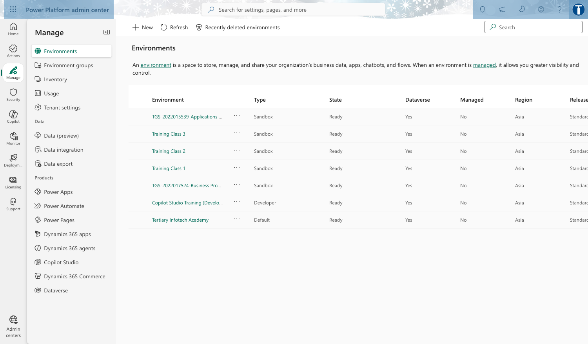

*Lab 1 — Integration Opportunity Scan: the workflow in the course environment.*

**Step-by-step**

1. Open the course environment in the maker portal and confirm you are in 'TGS-2022015539-Applications Integration with Power Apps and Power Automate' using the environment picker (top right).
2. Open reference workbook 'KinetEco Service Calls.xlsx' and read the Calls sheet — this is the manual process you are replacing.
3. Draw the current process as a swimlane: Requester -> Service Desk -> Engineer -> Reporting. Mark each hand-off where a human retypes data.
4. For every hand-off, record: source system, target system, data moved, frequency, and what breaks when it is done by hand.
5. Browse the connector catalogue and note which connector would serve each source and target.

   ```bash
   https://make.powerautomate.com/connectors/
   ```

6. Classify each opportunity as device / database / software / application integration — this is the K1 middleware-type vocabulary.
7. Score each candidate 1-5 for volume, error rate and business impact; rank the register by total score.

**Test it**

Your register lists at least six candidates, each naming a source system, a target system, a connector and a score. The top-ranked candidate should be the service-call intake — the one you automate in Lab 3.

> **Note:** This lab has its own folder at labs/lab-01/ containing the lab sheet, the data workbook it needs and the prebuilt flow packages. Build every object inside the course environment 'TGS-2022015539-Applications Integration with Power Apps and Power Automate'.

---


### Lab 2 — Feasibility Scan and Middleware Selection

Maps to: A2 Perform feasibility scan and assessment to identify potential middleware to be used; K1 Types of middleware and their features.

Goal: Take the top three opportunities from Lab 1 and run a structured feasibility scan against six criteria: connector availability, data readiness, licensing, security and governance, performance/delegation, and maintainability. Decide for each whether Power Platform is the right middleware — and be prepared to justify a 'no'.

**What you'll build**

A Feasibility Assessment Matrix scoring three candidates against six criteria, with a documented Build / Defer / Reject decision and justification for each.   (Tools: Power Platform admin center, connector catalogue, Microsoft licensing documentation.)

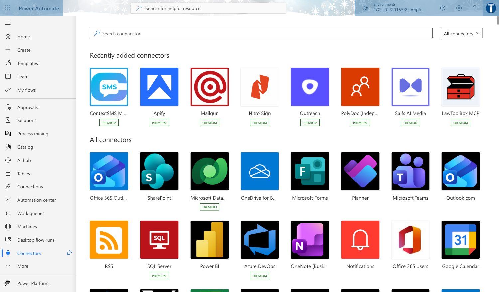

*Lab 2 — Feasibility Scan and Middleware Selection: the workflow in the course environment.*

**Step-by-step**

1. For each of your top three candidates, confirm a standard connector exists — and note whether it is Standard or Premium, because Premium changes the licence needed.

   ```bash
   https://make.powerautomate.com/connectors/
   ```

2. Assess data readiness: is the source structured, does it have a stable key, is it an Excel Table (Power Apps cannot bind to a loose range)?
3. Assess security and governance: who owns the data, does the flow need a service account, does a DLP policy separate the connectors you intend to combine?
4. Check the environment's DLP policies in the admin center and record any that would block your design.

   ```bash
   https://admin.powerplatform.microsoft.com/
   ```

5. Assess performance: estimate row counts and check each connector's delegation support and throttling limits.
6. Score each criterion 1-5, total the scores, and record a Build / Defer / Reject decision with a one-line justification.
7. Present your top candidate to the class in 2 minutes: the opportunity, the middleware, and why it is feasible.

**Test it**

Each of the three candidates has six scores, a total, and a decision with justification. At least one candidate should be Deferred or Rejected with a defensible reason — a scan where everything passes is not a scan.

> **Note:** This lab has its own folder at labs/lab-02/ containing the lab sheet, the data workbook it needs and the prebuilt flow packages. Build every object inside the course environment 'TGS-2022015539-Applications Integration with Power Apps and Power Automate'.

---


## Topic 02 — Power Automate

Cloud flows · triggers and actions · conditions · approvals · testing

**Key concepts**

- A cloud flow is a trigger plus a sequence of actions; the trigger is the event that starts the flow.
- Flow types: automated (event-driven), instant (manual/button), scheduled (recurrence), and desktop (RPA).
- Dynamic content passes output from one action into the input of the next — this is how data crosses application boundaries.
- Conditions, loops and scopes give a flow its control logic; expressions add computation.
- Testing is a first-class step: Flow checker, Test, and the 28-day run history are how you prove a connection works.


### Lab 3 — Trigger and Actions

Maps to: K2 Proper usage of middleware; A3 Utilise middleware to integrate data and functions across application programs.

Goal: Build your first cloud flow: an automated flow that fires when a new service-call item arrives and sends a formatted notification. This is the atom of every integration — one trigger, one or more actions, and dynamic content carrying data between them.

**What you'll build**

Flow 'Lab 3 - Trigger and Actions (DO NOT DELETE)' — an automated cloud flow with a trigger, a compose step and a notification action, tested with a successful run.   (Tools: Power Automate, Office 365 Outlook, Compose.)

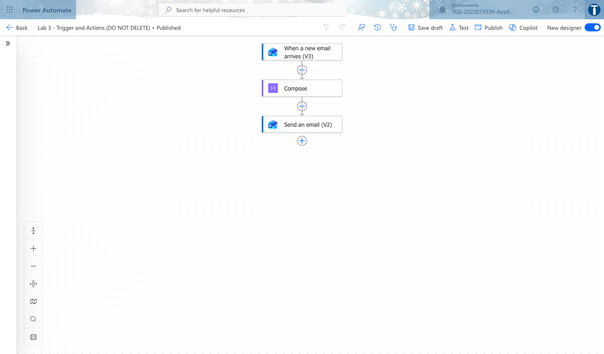

*Lab 3 — Trigger and Actions: the workflow in the course environment.*

**Step-by-step**

1. In make.powerautomate.com confirm the environment picker reads the course environment, then choose Create > Automated cloud flow.

   ```bash
   https://make.powerautomate.com
   ```

2. Name the flow exactly 'Lab 3 - Trigger and Actions (DO NOT DELETE)' and pick the trigger 'When a new email arrives (V3)'. Click Create.
3. On the trigger, set Folder to Inbox and expand Advanced options: set Subject Filter to SERVICE to narrow what fires the flow.
4. Add a Compose action. In its Inputs, insert dynamic content From, Subject and Received Time — this proves data crosses from the trigger into the next action.
5. Add 'Send an email notification (V3)'. Set To to your own address, Subject to 'Service call logged', and put the Compose Outputs in the Body.
6. Click Flow checker (top right) and clear every error and warning before saving.
7. Save, then click Test > Manually, and send yourself an email whose subject contains SERVICE.
8. Open the run in the 28-day run history and expand each step to read its raw inputs and outputs — this is how you evidence a working connection.

**Test it**

The run history shows one Succeeded run. Expanding the Compose step shows the sender, subject and timestamp carried from the trigger, and the notification email arrives in your inbox.

> **Note:** This lab has its own folder at labs/lab-03/ containing the lab sheet, the data workbook it needs and the prebuilt flow packages. Build every object inside the course environment 'TGS-2022015539-Applications Integration with Power Apps and Power Automate'.

---


### Lab 4 — Log to Excel

Maps to: A3 Utilise middleware to integrate data and functions across application programs; A5 Perform tests and checks on the connections between disparate application programs.

Goal: Extend Lab 3 so the service call is not merely announced but recorded. The flow writes a row into an Excel Online table in OneDrive, turning a notification into a durable integration between a mail system and a data store.

**What you'll build**

Flow 'Lab 4 - Log to Excel (DO NOT DELETE)' writing one row per service call into a formatted Excel Table, verified by inspecting the workbook.   (Tools: Power Automate, Office 365 Outlook, Excel Online (Business), OneDrive for Business.)

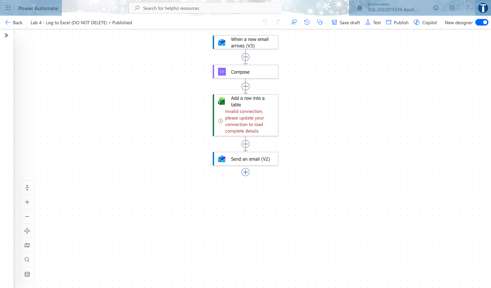

*Lab 4 — Log to Excel: the workflow in the course environment.*

**Step-by-step**

1. Upload 'KinetEco Service Calls.xlsx' from the lab data folder to your OneDrive for Business.
2. Open the workbook, select the Calls range and choose Insert > Table with 'My table has headers' ticked. Power Apps and Power Automate can only bind to a TABLE, never a loose range — this is the single most common beginner failure.
3. Rename the table ServiceCalls in Table Design, then save and close the workbook.
4. Copy the Lab 3 flow using Save As, and rename the copy exactly 'Lab 4 - Log to Excel (DO NOT DELETE)'.
5. Add the action 'Add a row into a table' (Excel Online Business). Pick the OneDrive location, the workbook and the ServiceCalls table.
6. Map each column to dynamic content: Reported By to From, Problem to Subject, Date Reported to Received Time.
7. Run Flow checker, save, and test the flow by sending another SERVICE email.
8. Open the workbook and confirm the new row. Then break the integration on purpose: rename the table in Excel, re-run, and read the error the flow returns.
9. Restore the table name and re-run to confirm the flow recovers — you have now both tested and diagnosed a connection.

**Test it**

A new row appears in the ServiceCalls table for each test email. The deliberate rename produces a clear failure in run history, and restoring the name returns the flow to Succeeded.

> **Note:** This lab has its own folder at labs/lab-04/ containing the lab sheet, the data workbook it needs and the prebuilt flow packages. Build every object inside the course environment 'TGS-2022015539-Applications Integration with Power Apps and Power Automate'.

---


### Lab 5 — Conditions and Branching

Maps to: K2 Proper usage of middleware; A3 Utilise middleware to integrate data and functions across application programs.

Goal: Real integrations rarely run in a straight line. Add a Condition so urgent service calls are escalated while routine ones are only logged, then add a scheduled digest flow that summarises the day's calls.

**What you'll build**

Flow 'Lab 5 - Conditions and Branching (DO NOT DELETE)' with a working If yes / If no branch, plus a scheduled recurrence flow producing a daily digest.   (Tools: Power Automate, Office 365 Outlook, Excel Online (Business), Recurrence.)

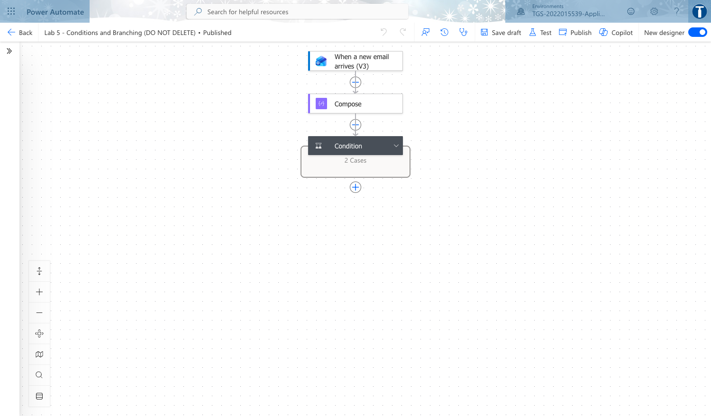

*Lab 5 — Conditions and Branching: the workflow in the course environment.*

**Step-by-step**

1. Save the Lab 4 flow as 'Lab 5 - Conditions and Branching (DO NOT DELETE)'.
2. After the trigger, add a Condition. Set the left side to the Subject dynamic content, the operator to 'contains', and the right side to URGENT.
3. In the If yes branch, add 'Send an email (V2)' to the duty engineer with high importance, and keep the Excel logging step in both branches.
4. In the If no branch, keep only the Excel row so routine calls are recorded without interrupting anyone.
5. Save and test twice: once with URGENT in the subject and once without, confirming a different path each time.
6. Create a second flow, a Scheduled cloud flow named 'Lab 5b - Daily Digest (DO NOT DELETE)', recurring daily at 18:00 Singapore time.
7. In the digest flow add 'List rows present in a table' against ServiceCalls, then a Select and a Create HTML table action.
8. Send the HTML table by email and run the flow manually to verify the digest renders.

**Test it**

Run history shows the URGENT test taking the If yes branch and the routine test taking If no. The digest flow sends one email containing an HTML table of the logged calls.

> **Note:** This lab has its own folder at labs/lab-05/ containing the lab sheet, the data workbook it needs and the prebuilt flow packages. Build every object inside the course environment 'TGS-2022015539-Applications Integration with Power Apps and Power Automate'.

---


### Lab 6 — Leave Application Approval

Maps to: A3 Utilise middleware to integrate data and functions across application programs; A5 Perform tests and checks on the connections between disparate application programs.

Goal: Add the human to the loop. Build an approval flow where a leave request is routed to an approver, the decision branches the flow, and the outcome is written back and notified — the canonical human-in-the-loop integration pattern.

**What you'll build**

Flow 'Lab 6 - Leave Application Approval (DO NOT DELETE)' with a Start and wait for an approval action, an outcome condition, and write-back to Excel.   (Tools: Power Automate, Approvals, Office 365 Outlook, Excel Online (Business), Microsoft Teams.)

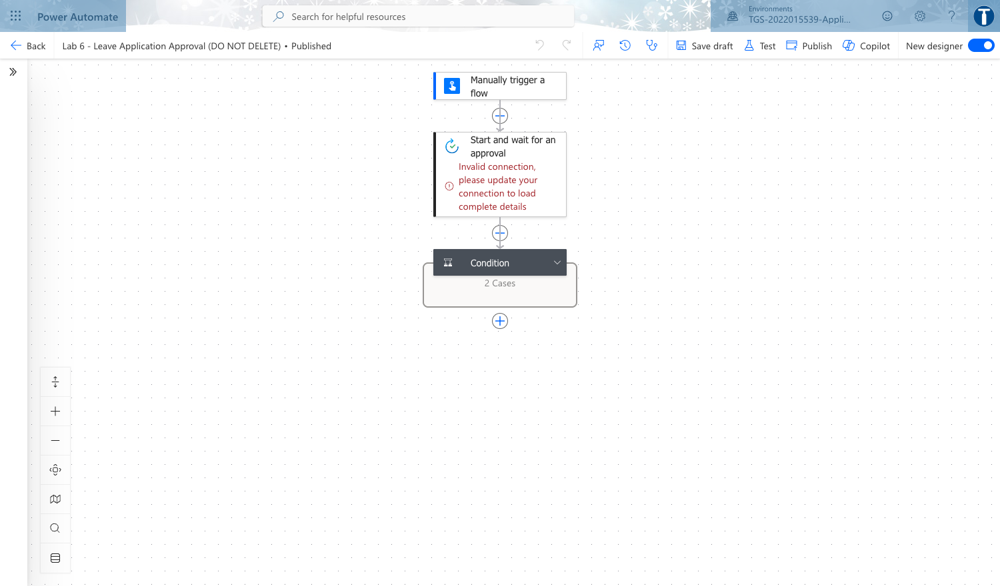

*Lab 6 — Leave Application Approval: the workflow in the course environment.*

**Step-by-step**

1. Create a new Instant cloud flow named 'Lab 6 - Leave Application Approval (DO NOT DELETE)' triggered manually, so you can test it repeatedly without waiting for an event.
2. Add inputs to the trigger: Applicant (text), Leave Type (text), Start Date (date), Days (number), Reason (text).
3. Add 'Start and wait for an approval'. Choose 'Approve/Reject - First to respond', and compose the Title and Details from the trigger inputs.
4. Set Assigned to to your own address so you can approve your own test runs. Approvals arrive in Teams and the Approvals app.
5. Add a Condition testing whether the Outcome dynamic content is equal to Approve.
6. In If yes, send a confirmation email to the applicant and add a row to an Excel LeaveLog table with status Approved.
7. In If no, send a rejection email including the approver's Comments, and log the row with status Rejected.
8. Save and run the flow, approve the request when it arrives, then run again and reject it.
9. Inspect both runs in run history and confirm the branch, the email and the Excel row match the decision each time.

**Test it**

Two runs complete: one Approved and one Rejected. Each produced the correct branch, the correct email, and a correctly-statused row in the LeaveLog table.

> **Note:** This lab has its own folder at labs/lab-06/ containing the lab sheet, the data workbook it needs and the prebuilt flow packages. Build every object inside the course environment 'TGS-2022015539-Applications Integration with Power Apps and Power Automate'.

---


## Topic 03 — Power Apps

Canvas apps · data sources · controls and formulas · publishing and sharing

**Key concepts**

- Canvas apps give pixel-level control of the UI; model-driven apps generate the UI from the data model.
- Apps run across platforms — browser, iOS, Android, Teams and embedded in SharePoint or Power BI.
- A data source is reached through a connector; the same app can bind to Dataverse, Excel, SharePoint or a REST API.
- Power Fx is the Excel-like formula language that binds controls to data and behaviour.
- Publish, version and share are the app lifecycle: every save creates a version you can restore.


### Lab 7 — Canvas App from Excel Data

Maps to: K3 Different types of platforms on which applications run; A4 Support API-level integration.

Goal: Create your first canvas app over the Excel table you built in Lab 4. Power Apps generates a three-screen browse/detail/edit app; you then read how each screen is wired so the generated app becomes something you can modify rather than a black box.

**What you'll build**

Canvas app 'Lab 7 - Canvas App from Excel (DO NOT DELETE)' — a working three-screen app bound to the ServiceCalls Excel table, saved and published.   (Tools: Power Apps Studio, Excel Online (Business), OneDrive for Business.)

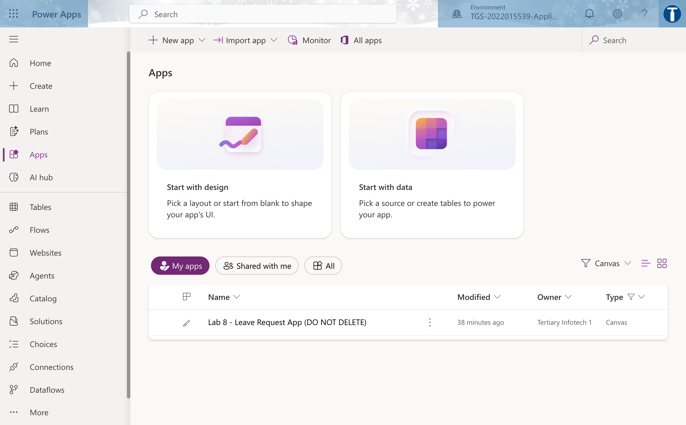

*Lab 7 — Canvas App from Excel Data: the workflow in the course environment.*

**Step-by-step**

1. Open make.powerapps.com and confirm the environment picker shows the course environment.

   ```bash
   https://make.powerapps.com
   ```

2. Choose Start with data > Excel, connect to OneDrive for Business, and select the ServiceCalls table from KinetEco Service Calls.xlsx.
3. Let Power Apps generate the app, then immediately File > Save as with the name 'Lab 7 - Canvas App from Excel (DO NOT DELETE)'.
4. Select BrowseGallery1 and read its Items property — this is the formula that binds the gallery to the data source.
5. Change the Items formula to sort and search the table, then confirm the gallery reorders live.

   ```bash
   SortByColumns(Search(ServiceCalls, TextSearchBox1.Text, "Problem"), "Date_x0020_Reported", Descending)
   ```

6. Select the detail screen and inspect the Item property to see how the selected record is passed between screens.

   ```bash
   BrowseGallery1.Selected
   ```

7. On the edit screen, read the OnSuccess and OnFailure of the form, and the SubmitForm call on the tick icon.

   ```bash
   SubmitForm(EditForm1)
   ```

8. Preview with F5, add a record, and confirm it appears in the Excel workbook.
9. Publish the app, then note the Version history under Details — every publish is a restorable version.

**Test it**

The app browses, filters and sorts real service-call data; adding a record through the app writes a new row to the Excel table, and the app appears in the Apps list as published.

> **Note:** This lab has its own folder at labs/lab-07/ containing the lab sheet, the data workbook it needs and the prebuilt flow packages. Build every object inside the course environment 'TGS-2022015539-Applications Integration with Power Apps and Power Automate'.

---


### Lab 8 — Blank Canvas App with Power Fx

Maps to: K3 Different types of platforms on which applications run; A6 Verify proper functioning of modules and applications across multiple or integrated platforms.

Goal: A generated app hides the mechanics. Build one from an empty screen so every control, variable and formula is yours: a leave-request form with validation, variables and navigation, which becomes the front end you wire to a flow in Topic 4.

**What you'll build**

Canvas app 'Lab 8 - Leave Request App (DO NOT DELETE)' — a two-screen app built from blank with validated inputs, variables and navigation.   (Tools: Power Apps Studio, Power Fx.)

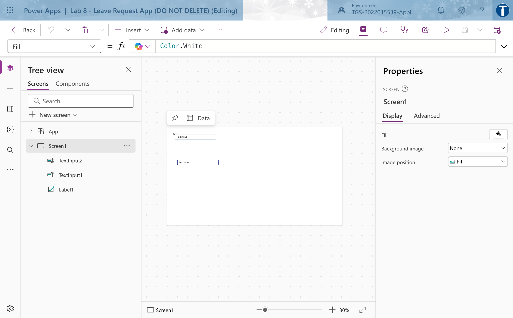

*Lab 8 — Blank Canvas App with Power Fx: the workflow in the course environment.*

**Step-by-step**

1. Create a blank canvas app with Tablet layout named 'Lab 8 - Leave Request App (DO NOT DELETE)'.
2. On Screen1 insert a Label as the title, then Text input controls named txtApplicant and txtReason, a Dropdown ddLeaveType, a Date picker dpStart and a Text input txtDays.
3. Set the dropdown Items to a literal table of leave types.

   ```bash
   ["Annual","Medical","Childcare","Unpaid"]
   ```

4. Insert a Button named btnSubmit and set its DisplayMode so it is disabled until the form is complete — validation before submission.

   ```bash
   If(IsBlank(txtApplicant.Text) || IsBlank(txtDays.Text), DisplayMode.Disabled, DisplayMode.Edit)
   ```

5. On btnSubmit OnSelect, set a global variable capturing the request and navigate to a confirmation screen.

   ```bash
   Set(gblRequest, {Applicant: txtApplicant.Text, LeaveType: ddLeaveType.Selected.Value, Start: dpStart.SelectedDate, Days: Value(txtDays.Text), Reason: txtReason.Text}); Navigate(scrConfirm, ScreenTransition.Cover)
   ```

6. Add a second screen scrConfirm with labels reading back the variable, proving state carried across screens.

   ```bash
   "Thank you " & gblRequest.Applicant & " - " & gblRequest.Days & " day(s) of " & gblRequest.LeaveType
   ```

7. Add a Back button on the confirmation screen that clears the variable and returns to the form.

   ```bash
   Set(gblRequest, Blank()); Reset(txtApplicant); Navigate(Screen1)
   ```

8. Use the App checker to clear all formula errors and accessibility warnings.
9. Save and publish the app.

**Test it**

The submit button stays disabled until the required fields are filled; submitting navigates to the confirmation screen showing the entered values; App checker reports no errors.

> **Note:** This lab has its own folder at labs/lab-08/ containing the lab sheet, the data workbook it needs and the prebuilt flow packages. Build every object inside the course environment 'TGS-2022015539-Applications Integration with Power Apps and Power Automate'.

---


### Lab 9 — Custom Connector and API Integration

Maps to: K5 Functions of Application Programming Interfaces (APIs); A4 Support API-level integration.

Goal: Connectors are the platform's API layer. Where no prebuilt connector exists you build a custom one. Create a custom connector over a public REST API, define its action and response schema, test it, and consume it from a canvas app.

**What you'll build**

Custom connector 'Lab 9 - Public Holiday API (DO NOT DELETE)' plus canvas app 'Lab 9 - API Consumer App (DO NOT DELETE)' displaying live API data.   (Tools: Power Apps custom connectors, REST, JSON, Power Fx.)

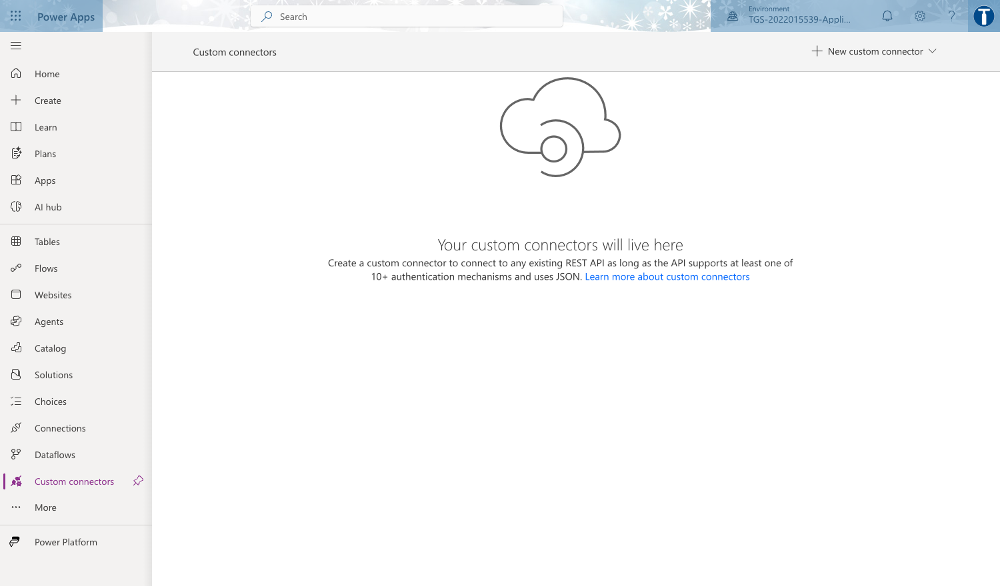

*Lab 9 — Custom Connector and API Integration: the workflow in the course environment.*

**Step-by-step**

1. In make.powerapps.com go to More > Discover all > Custom connectors, and choose New custom connector > Create from blank.
2. Name it 'Lab 9 - Public Holiday API (DO NOT DELETE)'. On General set Host to date.nager.at and the Base URL to /api/v3.
3. On Security choose No authentication — this API is public. Note in your workbook what you would choose for a real corporate API (OAuth 2.0 or API key).
4. On Definition add a New action: Summary 'Get public holidays', Operation ID GetPublicHolidays.
5. Set the Request by using Import from sample: verb GET and the URL below, which makes the year and country code path parameters.

   ```bash
   https://date.nager.at/api/v3/PublicHolidays/2026/SG
   ```

6. Use Import from sample on the Response with a real payload so the connector learns the schema — this is what gives you typed dynamic content downstream.
7. Create the connector, then open the Test tab, create a connection, and run the operation with year 2026 and country SG.
8. Create a canvas app named 'Lab 9 - API Consumer App (DO NOT DELETE)', add the custom connector as a data source, and load the API result into a collection on a button.

   ```bash
   ClearCollect(colHolidays, 'Lab9-PublicHolidayAPI'.GetPublicHolidays(2026,"SG"))
   ```

9. Add a gallery bound to colHolidays showing the date and the local name of each holiday.

**Test it**

The connector Test tab returns HTTP 200 with a JSON array of holidays. In the app, pressing the button fills the gallery with live public-holiday data from the external API.

> **Note:** This lab has its own folder at labs/lab-09/ containing the lab sheet, the data workbook it needs and the prebuilt flow packages. Build every object inside the course environment 'TGS-2022015539-Applications Integration with Power Apps and Power Automate'.

---


### Lab 10 — Cross-Platform Verification and Sharing

Maps to: A6 Verify proper functioning of modules and applications across multiple or integrated platforms; K3 Different types of platforms on which applications run.

Goal: An app that only works on the maker's screen is not integrated. Verify your apps run correctly in the browser, on the mobile player and embedded in Teams, then share them with the right permissions and record the results in a test matrix.

**What you'll build**

A completed Cross-Platform Verification Matrix for Labs 7-9, plus the apps shared and one app embedded in Microsoft Teams.   (Tools: Power Apps mobile, Microsoft Teams, Power Apps sharing.)

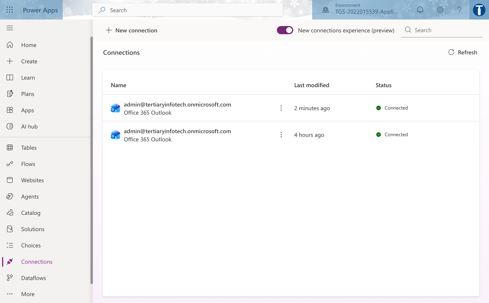

*Lab 10 — Cross-Platform Verification and Sharing: the workflow in the course environment.*

**Step-by-step**

1. Build a test matrix with your apps as rows and Browser, Mobile and Teams as columns, plus a column for defects found.
2. Run Lab 7 and Lab 8 in the browser at make.powerapps.com and record load time and any layout problem.
3. Install Power Apps mobile, sign in with the same account, and open each app. Note where a Tablet-layout app is awkward on a phone — a real compatibility finding.
4. In Teams, add the Power Apps app, then Add an app to a channel tab and select Lab 8. Confirm it renders and functions inside Teams.
5. Share Lab 8 with a classmate as a User (not Co-owner) and have them confirm they can run but not edit it.
6. Confirm your classmate also needs access to the underlying data source — sharing an app does not share its data. Record this as a finding.
7. Complete the matrix with a pass/fail and at least three concrete defects or limitations across the platforms.

**Test it**

Every cell of the matrix is filled for all three platforms, with at least three real defects or limitations recorded, and a classmate can run your shared app.

> **Note:** This lab has its own folder at labs/lab-10/ containing the lab sheet, the data workbook it needs and the prebuilt flow packages. Build every object inside the course environment 'TGS-2022015539-Applications Integration with Power Apps and Power Automate'.

---


## Topic 04 — Integrate Power Apps and Power Automate

Calling flows from apps · approvals · returning data · troubleshooting integration

**Key concepts**

- A canvas app calls a flow with the Power Apps (V2) trigger; parameters are typed and passed from controls.
- Respond to a Power App or flow returns data back to the app, closing the round trip.
- Approvals combine a flow, an approver and a decision branch — the classic human-in-the-loop integration.
- Integration issues cluster into technical (auth, connector), compatibility (data type, format) and performance (delegation, throughput).
- Delegation is the single most common Power Apps performance defect — know the warning and the mitigations.


### Lab 11 — Call a Flow from a Canvas App

Maps to: A4 Support API-level integration; A3 Utilise middleware to integrate data and functions across application programs.

Goal: Wire the Lab 8 app to a flow. The button no longer just sets a variable — it invokes a Power Automate flow with typed parameters, so the app becomes a front end to an integration rather than a form in isolation.

**What you'll build**

Flow 'Lab 11 - Submit Leave Request (DO NOT DELETE)' triggered from the app, and the Lab 8 app updated to call it with typed parameters.   (Tools: Power Apps, Power Automate, Power Apps (V2) trigger, Office 365 Outlook.)

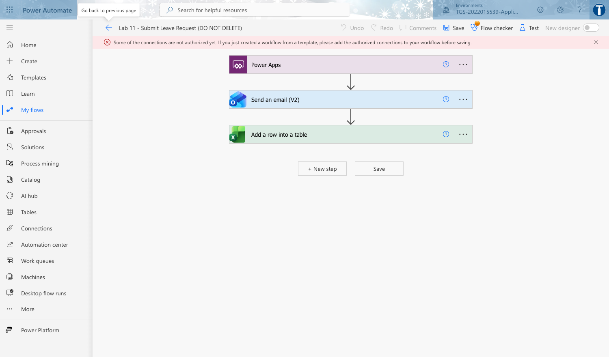

*Lab 11 — Call a Flow from a Canvas App: the workflow in the course environment.*

**Step-by-step**

1. In make.powerautomate.com create an Instant cloud flow named 'Lab 11 - Submit Leave Request (DO NOT DELETE)' and choose the trigger 'Power Apps (V2)'.
2. On the trigger add typed inputs matching the app: Applicant (text), LeaveType (text), StartDate (text), Days (number), Reason (text). Typed inputs are what make the call safe.
3. Add 'Send an email (V2)' to the approver, composing the body from the trigger inputs.
4. Add 'Add a row into a table' writing the request into the LeaveLog Excel table with status Submitted.
5. Save the flow, then open the Lab 8 app in Power Apps Studio.
6. On the Power Automate pane choose Add flow and select your Lab 11 flow.
7. Change btnSubmit OnSelect to call the flow with the control values in the trigger's parameter order, then navigate.

   ```bash
   'Lab11-SubmitLeaveRequest'.Run(txtApplicant.Text, ddLeaveType.Selected.Value, Text(dpStart.SelectedDate), Value(txtDays.Text), txtReason.Text); Navigate(scrConfirm)
   ```

8. Save and publish the app, then submit a real request from the app.
9. Confirm the flow run appears in run history, the email arrives and the Excel row is written.

**Test it**

Submitting from the app produces a Succeeded flow run whose trigger inputs exactly match what you typed, plus an approver email and a new LeaveLog row.

> **Note:** This lab has its own folder at labs/lab-11/ containing the lab sheet, the data workbook it needs and the prebuilt flow packages. Build every object inside the course environment 'TGS-2022015539-Applications Integration with Power Apps and Power Automate'.

---


### Lab 12 — Return Data from a Flow to the App

Maps to: A4 Support API-level integration; A6 Verify proper functioning of modules and applications across multiple or integrated platforms.

Goal: So far data has flowed one way. Close the round trip with 'Respond to a Power App or flow' so the flow returns a result the app displays — the pattern that lets an app use server-side logic, secured credentials or external APIs it cannot reach directly.

**What you'll build**

Flow 'Lab 12 - Return Leave Balance (DO NOT DELETE)' returning typed values, and the app displaying the returned balance and reference number.   (Tools: Power Apps, Power Automate, Respond to a Power App or flow, Excel Online (Business).)

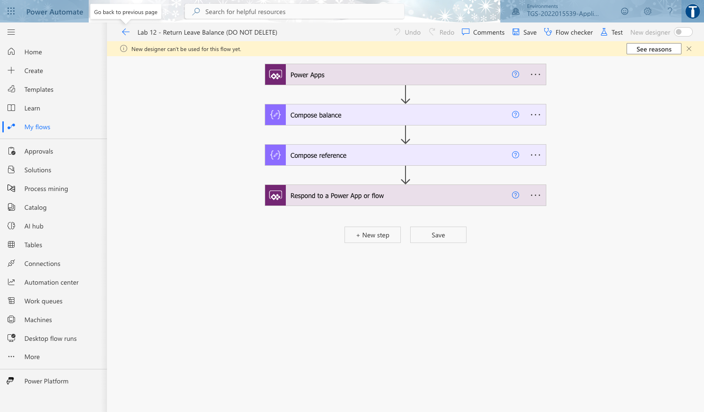

*Lab 12 — Return Data from a Flow to the App: the workflow in the course environment.*

**Step-by-step**

1. Create an Instant cloud flow 'Lab 12 - Return Leave Balance (DO NOT DELETE)' with a Power Apps (V2) trigger taking Applicant (text) and Days (number).
2. Add 'List rows present in a table' against the LeaveLog table, filtering to the applicant.
3. Add a Compose that computes the remaining balance from an annual entitlement of 14 days.

   ```bash
   sub(14, int(triggerBody()['number']))
   ```

4. Add 'Respond to a Power App or flow' with outputs Balance (number), Reference (text) and Status (text).
5. Set Reference to a generated unique value so the app receives something a user can quote.

   ```bash
   concat('LV-', utcNow('yyyyMMdd'), '-', rand(1000,9999))
   ```

6. Save the flow, return to the app, and add this flow alongside the Lab 11 flow.
7. Change the submit button to capture the flow's return value into a variable instead of discarding it.

   ```bash
   Set(gblResult, 'Lab12-ReturnLeaveBalance'.Run(txtApplicant.Text, Value(txtDays.Text))); Navigate(scrConfirm)
   ```

8. On the confirmation screen add labels bound to the returned fields.

   ```bash
   "Reference: " & gblResult.reference & "  |  Balance: " & gblResult.balance & " days"
   ```

9. Publish and submit a request, confirming the reference and balance shown in the app match the flow's run outputs.

**Test it**

The confirmation screen displays a reference number and remaining balance produced by the flow, and those values match the 'Respond to a Power App or flow' outputs in run history.

> **Note:** This lab has its own folder at labs/lab-12/ containing the lab sheet, the data workbook it needs and the prebuilt flow packages. Build every object inside the course environment 'TGS-2022015539-Applications Integration with Power Apps and Power Automate'.

---


### Lab 13 — End-to-End Approval App

Maps to: A3 Utilise middleware to integrate data and functions across application programs; A5 Perform tests and checks on the connections between disparate application programs.

Goal: Assemble everything into one working solution: the app submits, a flow requests approval, the approver decides in Teams, the outcome is written back, and the app shows live status. This is the integrated system the PP assessment asks you to build.

**What you'll build**

Flow 'Lab 13 - Approval Round Trip (DO NOT DELETE)' plus app 'Lab 13 - Leave Portal App (DO NOT DELETE)' showing live request status from the data source.   (Tools: Power Apps, Power Automate, Approvals, Microsoft Teams, Excel Online (Business).)

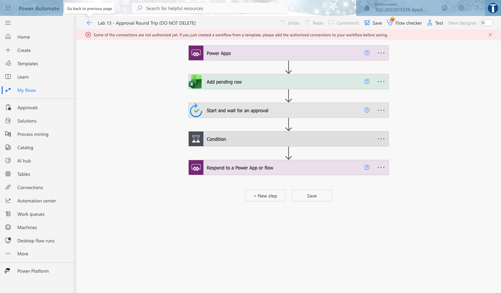

*Lab 13 — End-to-End Approval App: the workflow in the course environment.*

**Step-by-step**

1. Save the Lab 8 app as 'Lab 13 - Leave Portal App (DO NOT DELETE)' and add a third screen scrStatus.
2. Create an Instant cloud flow 'Lab 13 - Approval Round Trip (DO NOT DELETE)' with a Power Apps (V2) trigger taking the five request fields.
3. Add a row to LeaveLog with status Pending, then add 'Start and wait for an approval' assigned to the approver.
4. Add a Condition on the approval Outcome, and in each branch use 'Update a row' to set the LeaveLog status to Approved or Rejected with the approver's comments.
5. Add 'Respond to a Power App or flow' returning the final Status and Comments so the app can confirm immediately.
6. In the app, connect the LeaveLog Excel table as a data source and add a gallery on scrStatus bound to it, filtered to the current user.

   ```bash
   Filter(LeaveLog, Applicant = txtApplicant.Text)
   ```

7. Add a Refresh button so the learner can pull the latest status after the approver decides.

   ```bash
   Refresh(LeaveLog)
   ```

8. Publish, submit a request from the app, approve it in Teams, then refresh the status screen.
9. Repeat with a rejection and confirm the status screen and the Excel row both reflect the decision.

**Test it**

A request submitted in the app appears as Pending, moves to Approved or Rejected after the approver decides in Teams, and the app's status screen shows the change after Refresh.

> **Note:** This lab has its own folder at labs/lab-13/ containing the lab sheet, the data workbook it needs and the prebuilt flow packages. Build every object inside the course environment 'TGS-2022015539-Applications Integration with Power Apps and Power Automate'.

---


### Lab 14 — Troubleshoot and Optimise the Integration

Maps to: K4 Potential technical, compatibility or performance issues in application integration; A7 Highlight technical, compatibility or performance issues; A8 Implement modifications to mitigate the issues identified.

Goal: Deliberately break your working solution in three ways — technical, compatibility and performance — then diagnose each from the evidence, fix it, and record the finding. This is the A7/A8 discipline the assessment tests, and it is far easier to learn on a system you built.

**What you'll build**

A completed Integration Issue Log documenting three provoked defects with evidence, root cause and the implemented fix, plus the repaired solution.   (Tools: Power Automate run history, Power Apps App checker, Monitor, delegation warnings.)

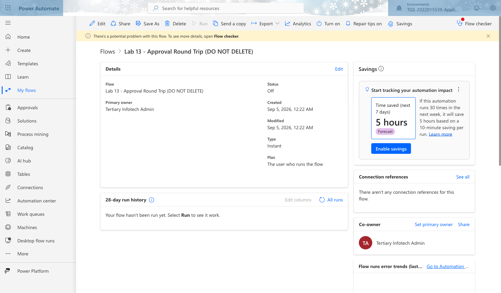

*Lab 14 — Troubleshoot and Optimise the Integration: the workflow in the course environment.*

**Step-by-step**

1. TECHNICAL — open the Lab 13 flow's connections and delete or invalidate the Excel connection, then run the app. Capture the exact error from run history.
2. Diagnose it as an authentication/connection failure, repair the connection, and re-run to prove the fix.
3. COMPATIBILITY — in the app pass Days as text rather than a number to the flow, and observe the schema-validation failure.

   ```bash
   'Lab13-ApprovalRoundTrip'.Run(txtApplicant.Text, ddLeaveType.Selected.Value, Text(dpStart.SelectedDate), txtDays.Text, txtReason.Text)
   ```

4. Fix it by coercing the type at the call site, and note the general rule that connector inputs are typed contracts.

   ```bash
   Value(txtDays.Text)
   ```

5. PERFORMANCE — add a gallery over a large data source using a non-delegable function and read the blue delegation warning.

   ```bash
   Filter(LeaveLog, Len(Applicant) > 3)
   ```

6. Explain why only the first 500 (or 2000) rows are processed, then rewrite it to a delegable filter and confirm the warning clears.

   ```bash
   Filter(LeaveLog, StartsWith(Applicant, txtSearch.Text))
   ```

7. Raise the data row limit in Settings > General and explain why that is a mitigation but not a cure.
8. Record all three in an Issue Log: symptom, evidence, classification, root cause, fix implemented, and how you verified the fix.
9. Re-run the full end-to-end scenario from Lab 13 to prove the repaired solution still works.

**Test it**

The Issue Log documents three issues, one of each class, each with real evidence, a root cause and a verified fix. The end-to-end approval scenario runs successfully after all repairs.

> **Note:** This lab has its own folder at labs/lab-14/ containing the lab sheet, the data workbook it needs and the prebuilt flow packages. Build every object inside the course environment 'TGS-2022015539-Applications Integration with Power Apps and Power Automate'.

---


## Reference — Integration Issues and How to Fix Them

Integration defects fall into three classes. The Practical Performance assessment asks you to highlight issues following integration (A7) and implement modifications to mitigate them (A8), so learn to name the class, cite the evidence and state the fix.

**Technical issues — the connection itself**

- Symptoms: the flow run fails with a 401 or 403; the connection shows a warning triangle; the app cannot load its data source.
- Causes: an expired, revoked or never-authenticated connection; the wrong account; a Data Loss Prevention policy separating two connectors you tried to combine; a missing Premium licence.
- Fixes: open the flow, re-authenticate each connection, and save. For anything that must outlive one person, run it under a dedicated service account rather than a personal account. Check the environment's DLP policies before designing a flow that spans connector groups.

**Compatibility issues — the shape of the data**

- Symptoms: a schema validation error the moment the flow is called; the right value lands in the wrong field; a date arrives as text.
- Causes: a type mismatch — text passed where the connector declares a number; a date format the target does not parse; an Excel range that is not a Table; a renamed column.
- Fixes: coerce the type at the CALL SITE, for example Value(txtDays.Text) rather than txtDays.Text. Treat a connector's inputs as a typed contract. Keep column names stable, and re-point the action after any rename.

**Performance issues — scale and throughput**

- Symptoms: a blue delegation warning in the formula bar; only the first rows appear; the app is slow to load; the connector returns a throttling error.
- Causes: a non-delegable function such as Len() or a complex nested condition; too many rows pulled to the device; connector request limits exceeded.
- Fixes: rewrite to a delegable function such as StartsWith() or Filter() on an indexed column; reduce rows at source; raise the data row limit in Settings > General as a stop-gap, understanding that it is a mitigation and not a cure; batch or throttle high-volume calls.

**Delegation — the one to remember**

Delegation means the filtering work is pushed DOWN to the data source rather than done on the device. When a formula cannot be delegated, Power Apps retrieves only the first 500 rows (raisable to 2,000) and filters those locally. The app does not fail — it silently shows an incomplete answer, which is far more dangerous than an error. Watch for the blue warning triangle in the formula bar and rewrite the formula until it disappears.

---


## Revision and Assessment Preparation

**How to revise**

- First pass: complete every lab in order, in the course environment, following this guide.
- Second pass: rebuild Labs 3, 4 and 11 from an empty flow without looking, until the trigger-action-test rhythm is automatic.
- For each lab, re-read the 'Test it' criterion and satisfy yourself you could demonstrate it to an assessor.
- Practise naming the three classes of integration issue and giving one concrete example and fix for each.
- Be able to explain, in your own words, what middleware is and why the Power Platform is an example of it.
- Practise the knowledge questions at the Tertiary Infotech practice exam site: https://exams.tertiaryinfotech.com

**What the Written Assessment (SAQ) covers**

Five open-ended short-answer questions, one hour, individual and open book. The questions test the underpinning knowledge: types of middleware and their features (K1), proper usage of middleware (K2), the platforms applications run on (K3), the technical, compatibility and performance issues that arise in integration (K4), and the functions of Application Programming Interfaces (K5).

**What the Practical Performance (PP) covers**

Four scenario-based hands-on tasks, ninety minutes, individual and open book. You build and demonstrate a working integration: identifying the opportunity and scanning feasibility (A1, A2), using the platform to integrate data and functions (A3), supporting API-level integration (A4), testing the connections (A5), verifying the modules work across platforms (A6), then highlighting the issues you meet (A7) and implementing the modifications that fix them (A8).

**On assessment day**

- Complete the TRAQOM course feedback survey on the LMS.
- Take the Assessment digital attendance by scanning the SSG QR code.
- Sit the Written Assessment, then the Practical Performance.
- Submit your answers on the LMS at https://lms-tms.tertiaryinfotech.com.
- Sign the Assessment Summary Record.
- A minimum of 75% attendance is required to be eligible for assessment and funding.


## Glossary

- **Application integration** — Connecting two or more applications so that data and functions pass between them without manual re-keying.
- **Middleware** — The software layer that sits between applications and brokers the exchange. Power Platform is low-code integration middleware.
- **iPaaS** — Integration Platform as a Service — cloud middleware with prebuilt connectors, such as Power Automate.
- **Connector** — A packaged API. Standard connectors are included in most licences; Premium connectors require a higher plan; a custom connector wraps any REST API.
- **Custom connector** — A connector you define yourself over an existing REST API by describing its host, security, actions and response schema.
- **Trigger** — The single event that starts a cloud flow. Every flow has exactly one.
- **Action** — A step the flow performs after the trigger. Actions run in the order set by their runAfter dependencies.
- **Dynamic content** — The output of one action, inserted as the input of a later one — how data crosses application boundaries inside a flow.
- **Cloud flow** — A flow that runs in the Power Automate service. Automated, instant and scheduled are the three types.
- **Desktop flow (RPA)** — A flow that drives a user interface, used for systems that expose no API.
- **Canvas app** — A Power App whose interface you design yourself, control by control. It can bind to any connector.
- **Model-driven app** — A Power App whose interface is generated from a Dataverse data model.
- **Power Fx** — The Excel-like formula language that binds Power Apps controls to data and behaviour.
- **Dataverse** — The governed data platform underlying Power Platform, providing tables, relationships and a security model.
- **Delegation** — Pushing filtering and sorting down to the data source instead of doing it on the device. Non-delegable formulas silently process only the first rows.
- **Environment** — A container for apps, flows and data. Work created in one environment cannot simply be moved to another.
- **Solution** — A package of Power Platform components used to move apps and flows between environments.
- **Connection reference** — A named pointer to a connection, used inside a solution so the same flow can bind to different credentials in each environment.
- **DLP policy** — A Data Loss Prevention policy that prevents specified connectors being combined in one flow or app.
- **Approval** — A built-in Power Automate action that requests a decision from a person and waits for the response.
- **Run history** — The 28-day record of every flow run, with the inputs and outputs of each action — your primary evidence when testing and diagnosing.
- **Flow checker** — The built-in validator that reports errors and warnings in a flow before you save it.
- **Feasibility scan** — A structured assessment of whether a candidate integration should be built, weighing connector availability, data readiness, licensing, security, performance and maintainability.
